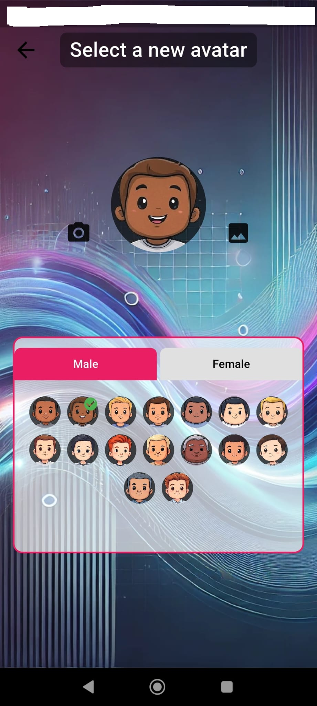
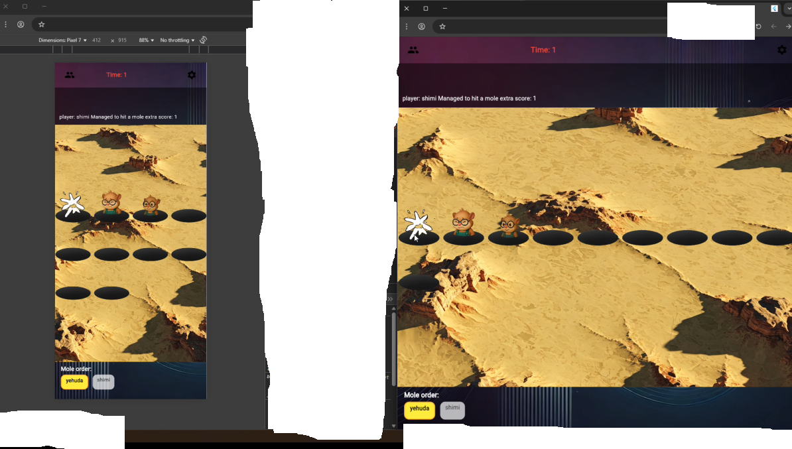
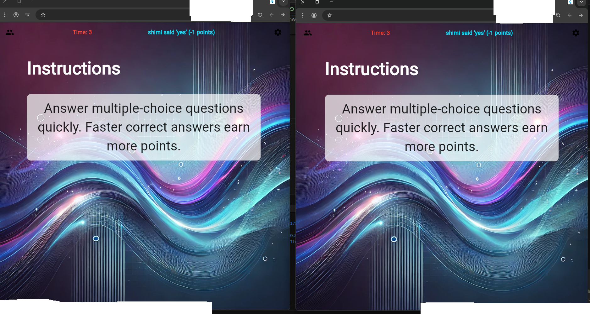

<div align="center">

# NexaBurst

Cross-platform multiplayer social party game built with Flutter and Firebase.

[](LICENSE)
[](https://flutter.dev)
[](https://dart.dev)
[](#)
[](https://firebase.google.com)

</div>

NexaBurst is a multiplayer party game where players create private rooms, play short competitive stages, and compete on a shared scoreboard. This repository includes the Flutter application, backend integration points, documentation, and development appendices used during the project lifecycle.

## Table of Contents

- [Project Overview](#project-overview)
- [Demo Media](#demo-media)
- [Core Features](#core-features)
- [Gameplay and Stage System](#gameplay-and-stage-system)
- [Architecture](#architecture)
- [Repository Layout](#repository-layout)
- [Getting Started](#getting-started)
- [Configuration and Secrets](#configuration-and-secrets)
- [Run Modes (Production vs Sandbox)](#run-modes-production-vs-sandbox)
- [Localization and Content Pipeline](#localization-and-content-pipeline)
- [Testing and Quality Checks](#testing-and-quality-checks)
- [Contributing](#contributing)
- [Security](#security)
- [License](#license)
- [Additional Documentation](#additional-documentation)

## Project Overview

NexaBurst is designed as a social game for small groups. Players authenticate, host or join a room using a room code, configure stages and options, then run through multiple rounds with synchronized state updates.

The app code is in `nexaburst/` and follows an MVVM-style separation of concerns:

- `Screens/` for UI
- `model_view/` for orchestration and state
- `models/` for data structures and backend-facing logic

Supporting material in `appendices/` includes helper scripts for multilingual content generation and an archived sensor-based gameplay experiment.

<h2 align="center">Demo Media</h2>

<h3 align="center">Mobile Experience & Gameplay</h3>
<table align="center">
  <tr>
    <td align="center" width="50%">
      <video src="https://github.com/user-attachments/assets/13d70bfb-78f4-4d57-a169-067f1f0b7b47" autoplay loop muted playsinline width="60%"></video>
    </td>
    <td align="center" width="50%">
      
    </td>
  </tr>
</table>

<h3 align="center">Web & Desktop Interface</h3>
<table align="center">
  <tr>
    <td align="center" width="50%">
      
    </td>
    <td align="center" width="50%">
      
    </td>
  </tr>
</table>


## Core Features

- Cross-platform Flutter app targeting Android, iOS, and Web
- Multiplayer room lifecycle with room creation and join-by-code flow
- Real-time game state updates with Firebase Cloud Firestore
- Presence tracking and disconnect cleanup using Firebase Realtime Database
- Email/password authentication with Firebase Auth
- Avatar upload flow via Cloudinary
- Six distinct game stages with per-stage rounds and score aggregation
- Optional global modes:
  - Drinking mode
  - Forbidden words mode (speech-to-text based)
- Localization infrastructure with broad language coverage (`static_text.json` currently contains 133 language keys including English)
- Debug sandbox flow with fake services for offline and rapid UI/logic testing

## Gameplay and Stage System

A typical session:

1. Authenticate (sign up or log in)
2. Create a room or join a room by code
3. Configure stages and options
4. Wait for players, then start
5. Play through stage sequence
6. Show final summary and winner

Current stages (from in-app translation keys):

1. `level1`: Trivia Blitz
2. `level2`: Wheel & Cups
3. `level3`: Brain Teaser
4. `level4`: Social Guess
5. `level5`: Whack-a-Mole
6. `level6`: Prisoner's Dilemma

Optional mode overlays:

- Drinking mode can mark players for drink penalties based on round outcomes.
- Forbidden words mode listens for disallowed words and applies penalties.

## Architecture

NexaBurst uses a layered approach:

- View layer (`nexaburst/lib/Screens/`): Flutter UI screens and widgets
- ViewModel layer (`nexaburst/lib/model_view/`): game flow, room lifecycle, player management, stage orchestration
- Model/service layer (`nexaburst/lib/models/`): data models, Firebase interactions, mode logic, loaders

Backend role split:

- Firebase Auth: user authentication
- Cloud Firestore: room documents, players, levels, round data, scores
- Firebase Realtime Database: presence and disconnect signaling
- Cloudinary: avatar image uploads

Synchronization and state progression are coordinated through dedicated services in `sync_players`, `presence`, and the stage managers under `model_view/room/game/Levels/`.

## Repository Layout

```text
nexaburst-multiplayer-game/
|- .github/
|  |- ISSUE_TEMPLATE/
|  |- pull_request_template.md
|- docs/
|  |- example_01.png
|  |- example_02.png
|  |- example_03.png
|  |- example.mp4
|- nexaburst/
|  |- lib/
|  |  |- Screens/
|  |  |- model_view/
|  |  |- models/
|  |  |- debug/
|  |  |- main.dart
|  |  |- constants.dart
|  |- assets/
|  |  |- texts/
|  |  |- audio/
|  |  |- sprites/
|  |  |- images/
|  |- test/
|  |- pubspec.yaml
|  |- .env.example
|- appendices/
|  |- readme.md
|  |- helper_scripts/
|  |- experimental_game_level_hight/
|- README.md
|- CONTRIBUTING.md
|- SECURITY.md
|- CODE_OF_CONDUCT.md
|- CHANGELOG.md
|- LICENSE
```

## Getting Started

### Prerequisites

- Flutter SDK (compatible with `sdk: ^3.8.1` in `nexaburst/pubspec.yaml`)
- Dart SDK (included with Flutter)
- Android Studio or VS Code with Flutter/Dart plugins
- Android emulator/device or iOS simulator/device
- Python 3.8+ (only if you plan to run helper scripts)

### Clone and Install

```bash
git clone https://github.com/y-haviv/nexaburst-multiplayer-game.git
cd nexaburst-multiplayer-game/nexaburst
flutter pub get
```

### Run

Production-style mode (real backend services):

```bash
flutter run --dart-define=DEBUG_MODE=false
```

Sandbox mode (fake services and debug helpers):

```bash
flutter run --dart-define=DEBUG_MODE=true
```

If you omit `DEBUG_MODE`, the app defaults to `false` (real backend mode).

### Build Examples

```bash
# Android APK
flutter build apk --release

# Android App Bundle
flutter build appbundle --release

# Web
flutter build web --release

# iOS (macOS + Xcode required)
flutter build ios --release
```

## Configuration and Secrets

The repository intentionally excludes sensitive configuration files.

### Native Firebase Config

Add these files locally:

- Android: `nexaburst/android/app/google-services.json`
- iOS: `nexaburst/ios/Runner/GoogleService-Info.plist`

Both are already ignored in `.gitignore`.

### Web Firebase and Cloudinary Config

For web initialization and avatar upload variables, use `nexaburst/.env.example`:

```bash
cd nexaburst
cp .env.example .env
```

PowerShell alternative:

```powershell
Copy-Item .env.example .env
```

Expected keys:

- `FIREBASE_API_KEY`
- `FIREBASE_AUTH_DOMAIN`
- `FIREBASE_PROJECT_ID`
- `FIREBASE_STORAGE_BUCKET`
- `FIREBASE_MESSAGING_SENDER_ID`
- `FIREBASE_APP_ID`
- `FIREBASE_DATABASE_URL`
- `CLOUDINARY_CLOUD_NAME`
- `CLOUDINARY_UPLOAD_PRESET`

## Run Modes (Production vs Sandbox)

### `DEBUG_MODE=false`

- Uses real Firebase/Auth/Firestore/Realtime DB services
- Uses real user repository/service implementations
- Intended for real multiplayer sessions and integration validation

### `DEBUG_MODE=true`

- Uses fake implementations for key services (auth, room/game sync, players)
- Useful for UI development, navigation checks, and deterministic stage flow tests
- Does not initialize Firebase in `main.dart`

## Localization and Content Pipeline

Runtime localization is loaded from:

- `nexaburst/assets/texts/static_text.json`

Stage content lives in:

- `nexaburst/assets/texts/lv01_questions.json`
- `nexaburst/assets/texts/lv02_wheel.json`
- `nexaburst/assets/texts/lv03.json`
- `nexaburst/assets/texts/lv04.json`

Helper scripts are in `appendices/helper_scripts/`.

Setup:

```bash
cd appendices/helper_scripts
pip install -r requirements.txt
cp .env.example .env
```

CLI examples:

```bash
# Fetch trivia questions
python main.py fetch --source trivia --out output.json --amount 25

# Generate AI questions (requires OPENAI_API_KEY)
python main.py fetch --source ai --out output.json --amount 10

# Translate an existing JSON file into configured target languages
python main.py translate --file path/to/file.json
```

## Testing and Quality Checks

Recommended local checks before opening a PR:

```bash
cd nexaburst
flutter analyze
flutter test
flutter format lib test
```

Current test coverage is minimal; `nexaburst/test/widget_test.dart` is still the template-style starter test. Contributions that add unit/widget/integration coverage are valuable.

## Contributing

Contributions are welcome in code, architecture feedback, bug reports, and documentation improvements.

Start here:

- [CONTRIBUTING.md](CONTRIBUTING.md)
- Issue templates in `.github/ISSUE_TEMPLATE/`
- Pull request checklist in `.github/pull_request_template.md`

If you propose large changes, open an issue first to align on scope and approach.

## Security

Please do not post security vulnerabilities publicly.

- Follow [SECURITY.md](SECURITY.md) for disclosure guidance.

## License

This project is licensed under the GNU General Public License v3.0.

- Full text: [LICENSE](LICENSE)

## Additional Documentation

- [CHANGELOG.md](CHANGELOG.md)
- [CODE_OF_CONDUCT.md](CODE_OF_CONDUCT.md)
- [nexaburst/README.md](nexaburst/README.md)
- [nexaburst/lib/README.md](nexaburst/lib/README.md)
- [appendices/readme.md](appendices/readme.md)
- [appendices/helper_scripts/README.md](appendices/helper_scripts/README.md)
- [appendices/experimental_game_level_hight/README.md](appendices/experimental_game_level_hight/README.md)
