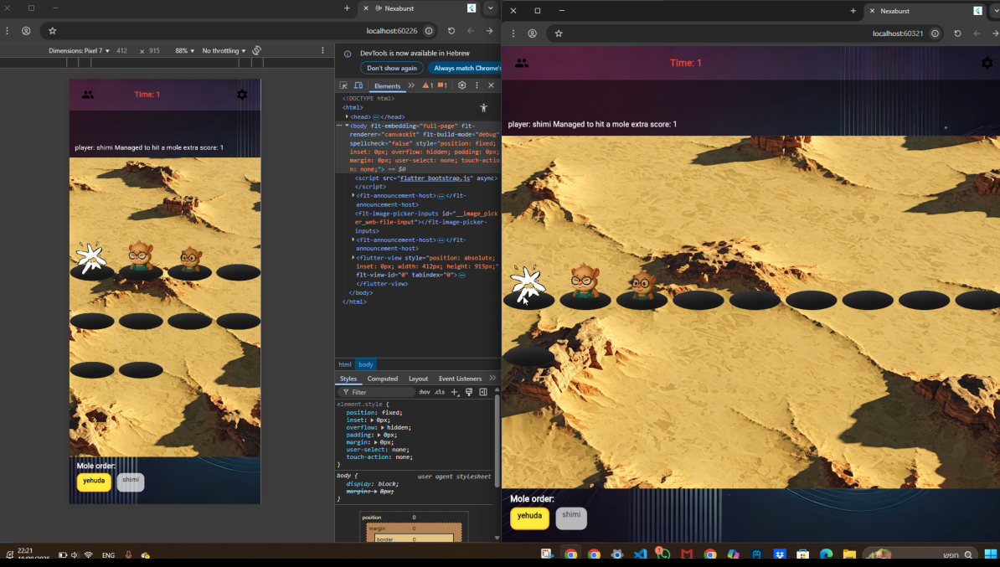
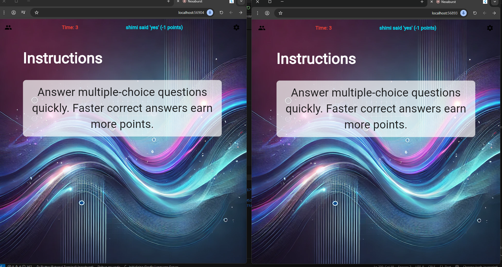
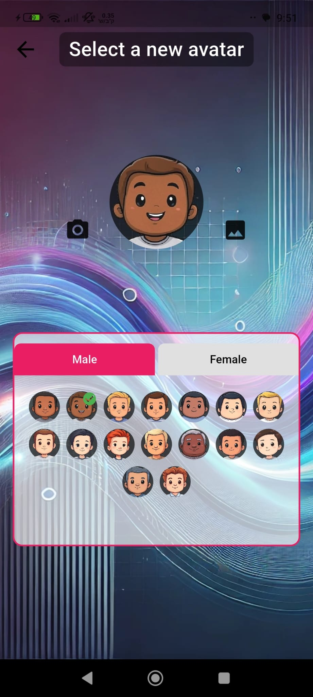

<div align="center">

# 🎮 NexaBurst

### Social Party Game (Flutter)

[](LICENSE)
[](https://flutter.dev)
[](https://dart.dev)
[]()
[](https://firebase.google.com)

</div>

One-line summary: NexaBurst is a cross-platform, multiplayer social party game built with Flutter and Dart. This repository contains the application source, supporting materials, experiments, and development artifacts intended to demonstrate full-cycle app development.

---

## Demo & Media

### Screenshots

<div align="center">

| Sample Image | Sample Image |
|:-----------:|:--------:|
|  |  |

| Sample Image |
|:------------:|
|  |

</div>

### Demo Video

<div align="center">

[](assets/example.mp4)

**[📹 Full Demo Video](assets/example.mp4)** — Interactive walkthrough of the application

For additional recorded demos (room creation, registration, debug mode), see the `appendices/final_presentation/videos/` folder.

</div>

---

## Highlights

- Cross-platform: Android, iOS, Web (via Flutter)
- MVVM architecture, modular codebase, and a development sandbox for rapid testing
---

## Table of Contents
- Demo media
- Key features
- Concept & user journey
- Game stages (detailed)
- Repository layout & code map
- Developer setup (requirements & run)
- Configuration & secrets (Firebase)
- Localization pipeline
- Development sandbox & testing
---

## Key features
- Cross-platform Flutter app: Android, iOS and Web-ready.
- MVVM architecture for clear separation of UI and business logic.
- Multiplayer rooms with join/create flow and room codes.
- Several short mini-game stages with scoring and round management.
- Global game modes (e.g., drinking-mode, forbidden-words mode with speech-to-text).
- Localization system and scripts for many languages.
- Firebase-based backend for authentication and game-state (configurable).

Concept & user journey
- Concept: A fast social party experience where friends join a private match, play short competitive/cooperative stages, and accumulate points to decide the winner.
- Typical flow:
	1. Register / sign in (email)
	2. Create or join a private room using a short room code
	3. Configure rounds, game modes and player settings
	4. Play through a sequence of stages (short, varied mechanics)
	5. Review scores, see the winner and optionally replay

Game stages (detailed)
- Trivia — Timed multiple-choice questions sourced from an API; scoring favors speed and accuracy.
- Lucky / Wheel — Randomized wheel mechanics for prizes or penalties; supports custom weights.
- Logic & Puzzle — Short puzzles requiring reasoning or pattern recognition under time pressure.
- Social Prediction — Players predict other players’ answers; scoring compares participant responses.
- Reaction — Tap/press-based challenges measuring speed and accuracy (Whack-a-Mole style).
- Strategic Decision — Short rounds inspired by Prisoner’s Dilemma focused on group strategy and tradeoffs.

Repository layout & code map
- `nexaburst/` — Main Flutter project (open this folder in Android Studio or VS Code as the primary project):
	- `nexaburst/lib/main.dart` — Application entrypoint and route initialization.
	- `nexaburst/lib/constants.dart` — App-wide constants and configuration toggles.
	- `nexaburst/lib/model_view/` — ViewModels and app state management (primary logic layer).
	- `nexaburst/lib/models/` — Data models and DTOs for players, rounds, and scoreboard.
	- `nexaburst/lib/Screens/` — UI screens grouped by feature (authorization, room, menu, game stages).
	- `nexaburst/assets/` — App-specific assets (sprites, avatars, icons, texts).
	- `nexaburst/debug/` — Development helpers, fake models and sandbox scaffolding.
- `appendices/` — Supporting artifacts, experiments and presentation materials:
	- `appendices/experimental_game_level_hight/` — Experimental height-estimation prototype (sensor-based).
	- `appendices/final_presentation/` — Slide deck and recorded demo videos used in presentations.
	- `appendices/helper_scripts/` — Python utilities and automation scripts used for localization and content import.
	- `appendices/development_process_in_stages.pdf` — Document detailing the project development phases.
- `assets/` — Repository-level media used in the README and quick demos (screenshots, short video).

Developer setup (requirements & run)
1. Install prerequisites:
	- Flutter SDK (stable channel) — https://flutter.dev
	- Android Studio or VS Code with Flutter/Dart plugins
	- A connected Android device or emulator for quick testing
2. Clone and fetch dependencies:

```powershell
git clone https://github.com/y-haviv/nexaburst-multiplayer-game.git
cd nexaburst-multiplayer-game
cd nexaburst
flutter pub get
```

3. Open `nexaburst/` in your IDE and run on a device/emulator.

## Testing & Quality Assurance

### Running Tests

```bash
# Navigate to the Flutter project
cd nexaburst

# Run all unit and widget tests
flutter test

# Run tests with coverage
flutter test --coverage

# Run tests for a specific file
flutter test test/model_view/auth_manager_test.dart
```

### Code Analysis

```bash
# Analyze code for issues and style violations
flutter analyze

# Format code according to style guidelines
flutter format lib/ test/

# Check for unused imports and code
dart fix --dry-run  # Preview fixes
dart fix            # Apply fixes
```

### Development with Debug Mode

```bash
# Run with debug mode enabled (includes sandbox)
flutter run --dart-define=DEBUG_MODE=true

# Access debug panel in-app to:
# - Jump to specific screens
# - Use fake data
# - Test without Firebase
# - Trigger game events manually
```

### Manual Testing Checklist

Before releasing, verify:

- [ ] **Authentication** — Login, signup, and session persistence work
- [ ] **Rooms** — Create, join, and leave rooms without issues
- [ ] **Game Stages** — All 6 stages are playable and score correctly
- [ ] **Localization** — UI displays in multiple languages
- [ ] **Responsive UI** — Layout works on various screen sizes
- [ ] **Performance** — No lag or stuttering during gameplay
- [ ] **Network** — Firebase sync works reliably
- [ ] **Error Handling** — Graceful recovery from network errors
- [ ] **Accessibility** — UI is navigable and readable

## Configuration & secrets
- The repository intentionally excludes private service credentials. To enable Firebase and other cloud features, add the appropriate files locally:
	- Android: place `google-services.json` into `nexaburst/android/app/`.
	- iOS: place `GoogleService-Info.plist` into `nexaburst/ios/Runner/`.
- For interview demos, the app includes a sandbox mode (see `nexaburst/debug/`) to run flows without live backend services.

Localization pipeline
- Source English text and per-stage JSONs live in `nexaburst/assets/texts/`.
- Translation and generation scripts live in `appendices/helper_scripts/`. Re-run these scripts to regenerate localized JSON payloads when strings change.

Development sandbox & testing
- Use the built-in sandbox to jump directly to screens and use fake data for deterministic testing of UI/UX and logic.
- Recommended tests to add before wide publication:
	- Unit tests for key `model_view` view models.
	- Widget tests for navigation and critical screens.

---

## Project Documentation

Beyond this README, explore:

- **[CONTRIBUTING.md](CONTRIBUTING.md)** — How to engage, report issues, and development guidelines
- **[SECURITY.md](SECURITY.md)** — Security practices and vulnerability reporting
- **[CODE_OF_CONDUCT.md](CODE_OF_CONDUCT.md)** — Community standards and expected behavior
- **[CHANGELOG.md](CHANGELOG.md)** — Version history and feature timeline
- **[nexaburst/README.md](nexaburst/README.md)** — Detailed app architecture and code organization
- **[nexaburst/lib/README.md](nexaburst/lib/README.md)** — Core library structure and patterns
- **[appendices/README.md](appendices/README.md)** — Supporting materials and helper scripts
- **[appendices/helper_scripts/README.md](appendices/helper_scripts/README.md)** — Localization pipeline guide
- **[appendices/experimental_game_level_hight/README.md](appendices/experimental_game_level_hight/README.md)** — Sensor experiment documentation

---

## Contributing, License & Contact

- **Contributing**: See [CONTRIBUTING.md](CONTRIBUTING.md) for development guidelines, code standards, and how to engage with the project.
- **License**: This repository is distributed under a **Proprietary License** (see [LICENSE](LICENSE) for full terms).
- **Security**: Report security issues privately via [SECURITY.md](SECURITY.md).
- **Contact**: Reach out through the GitHub profile associated with this repository for questions, code feedback, or inquiries.

---

## Acknowledgments

- **Flutter & Dart** communities for excellent documentation and tooling
- **Firebase** for real-time backend infrastructure
- Portfolio project for demonstrating professional software engineering practices

